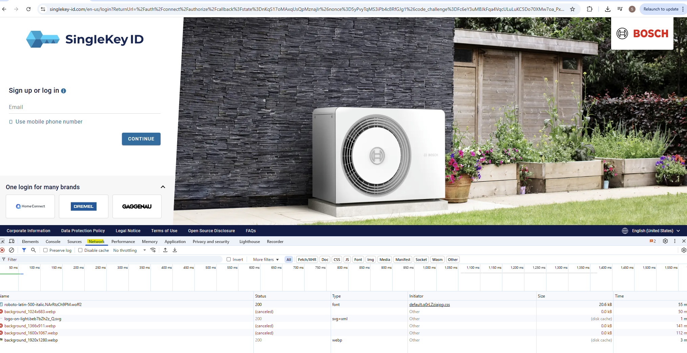
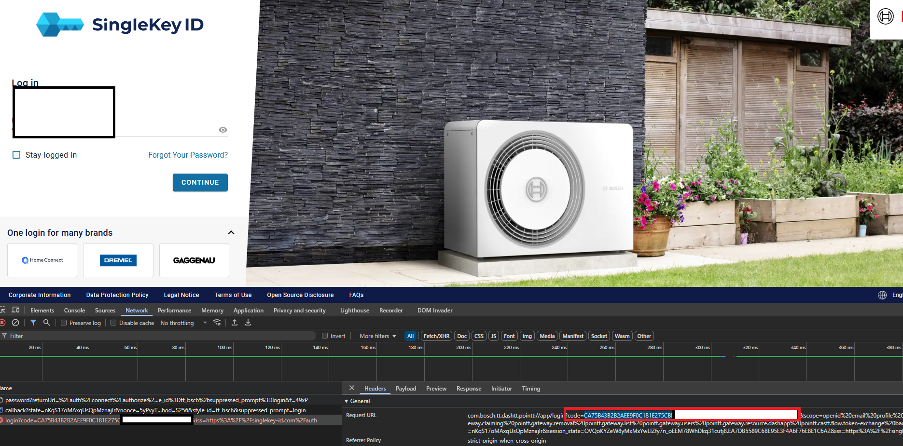

# Bosch HomeCom Easy integration for Home Assistant

[](https://github.com/serbanb11/bosch-homecom-hass/releases/latest)
[](https://github.com/hacs/integration)


This project is an integration for Bosch HomeCom Easy enabled appliances. It is not affiliated with either Bosch or Home Assistant.

***At the moment login using username and password is not working due to captch enforced by SingleKey ID. In order to login follow the following flow***<br />

### Step-by-Step Instructions

#### 1. Open the Authorization URL

Open the following URL in your browser:

```
https://singlekey-id.com/auth/connect/authorize?state=nKqS17oMAxqUsQpMznajIr&nonce=5yPvyTqMS3iPb4c8RfGJg1&code_challenge=Fc6eY3uMBJkFqa4VqcULuLuKC5Do70XMw7oa_Pxafw0&redirect_uri=com.bosch.tt.dashtt.pointt://app/login&client_id=762162C0-FA2D-4540-AE66-6489F189FADC&response_type=code&prompt=login&scope=openid+email+profile+offline_access+pointt.gateway.claiming+pointt.gateway.removal+pointt.gateway.list+pointt.gateway.users+pointt.gateway.resource.dashapp+pointt.castt.flow.token-exchange+bacon+hcc.tariff.read&code_challenge_method=S256&style_id=tt_bsch
```

---

#### 2. Open Developer Tools (Network Tab)

- Press `F12` or right-click > **Inspect**.
- Go to the **Network** tab.



---

#### 3. Log In Using Your Credentials

- Enter your **username and password** on the loaded page.
- Complete any CAPTCHA if required.
- Wait for the login to complete and redirect.

> You may see a redirect error due to unsupported URI scheme (`com.bosch.tt.dashtt.pointt://...`). This is expected.

---

#### 4. Extract the Authorization Code

- In the **Network tab**, find the request to the redirect URI:
  ```
  com.bosch.tt.dashtt.pointt://app/login?code=YOUR_CODE_HERE&state=...
  ```
- Copy only the value of the `code` parameter. This values should end in **-1**

  Example:
  ```
  code=3d7a2ff1f39e4d509e83012b45e7abcd-1
  ```



---

#### 5. Paste Code Into Home Assistant

- Go back to your Home Assistant (or related app).
- When prompted for an **authorization code**, paste the code you copied.
- Submit it to complete the login.

✅ Done! You are now authenticated.

---

#### 🛠️ Tips

- Use a **private window** to avoid session conflicts.
- If the network request is hard to find, filter by `redirect_uri` or search for `code=`.

---

## Supported Devices

***At the moment this integration was tested only with:***
- **Bosch Climate Class 6000i**
- **Bosch Climate Class 5000i**
- **Bosch Climate Class 3000i** (that are *not* based on Midea)
- **K40**
- **K30**
  - Buderus Logatherm WLW 186i heat pump with the MX300 communication module
- **wddw2**
  - Hydronext 5700s with wifi module Bosch 7736505449

***Users reported that Bosch Climate Class 3000i and 7000i based on Midea are not working.***

</br>

# Main features
This integration has the following features:
* Retrieve an authentication token based on username and password from singlekey-id.com
* Refresh token if expired
* The state of all entities are updated on each action and every 5 minutes.
* Using pure async implementation for reduced load on the platform.
* Read devices notifications

</br>

# Installation instructions
## Bosch Home
Before installing the integration you need to install Bosch HomeCom Easy APP and configure your devices.

### Installation
The easiest way, if you are using HACS, is to install it through [HACS](https://hacs.xyz/). This integration can be added using [custom repo](https://www.hacs.xyz/docs/faq/custom_repositories/)
URL: https://github.com/serbanb11/bosch-homecom-hass

For manual installation, copy the bosch_homecom folder and all of its contents into your Home Assistant's custom_components folder. This folder is usually inside your /config folder. If you are running Hass.io, use SAMBA to copy the folder over. If you are running Home Assistant Supervised, the custom_components folder might be located at /usr/share/hassio/homeassistant. You may need to create the custom_components folder and then copy the bosch_homecom folder and all of its contents into it.

A dialog box will popup asking you to input your Bosch HomeCom Easy APP username and password. 

## Bosch Climate Residential Air Conditioning (RAC) 
### Entities
- climate entity with the following features
    
    fan_modes = [FAN_AUTO, FAN_DIFFUSE, FAN_LOW, FAN_MEDIUM, FAN_HIGH]

    hvac_modes = [OFF, AUTO, HEAT, COOL, DRY, FAN_ONLY]
    
    preset_modes = [PRESET_NONE, PRESET_BOOST, PRESET_ECO]
    
    swing_horizontal_modes = [SWING_OFF, SWING_ON]
    
    swing_modes = [SWING_OFF, SWING_ON]
 - select entities
   
   horizontal position: center, left, right, swing
   
   vertical positon: auto, angle 1-5, swing
 - switch for plasmacluster
 - sensor for notifications

## Bosch k30 and k40
- climate entity

- water heater entity

- select entities

  away mode = [ON, OFF]

  domestic hot water (DHW): [OFF, low, high, eco, ownprogram] 

  domestic hot water temperature: [OFF, low, high, eco] 

  heating circuit (HC): [off, manual, auto]

  heatcool mode: [heat, cool, heatCool]

  summerwinter: [forced, off, cooling]

  holiday_mode: [hm1-hm8]

- sensors

  notifications
  
  domestic hot water with state current temp and attributes:
   - operationMode
   - currentTemperatureLevel
   - charge
   - chargeRemainingTime
   - singleChargeSetpoint
   - temperature per leve low, high, eco
  
  heating circuit with state current mode and attributes:
   - currentSuWiMode
   - heatCoolMode
   - roomTemp
   - actualHumidity
   - manualRoomSetpoint
   - currentRoomSetpoint
   - coolingRoomTempSetpoint

  heat source with state type and attributes:
   - numberOfStartsCh
   - numberOfStartsDhw
   - numberOfStartsTotal
   - returnTemperature
   - actualSupplyTemperature
   - actualModulation
   - outputProduced
   - eheater
   - compressor

### Extra attribute sensor template k40
Template for Sensor
```
{{ state_attr('sensor.boschcom_k40_<your-id>_heat_source', 'actualSupplyTemperature') | replace('C', '') | float }}
```
Advanced options → Availability template:
```
{{ states('sensor.boschcom_k40_<your-id>_heat_source') not in ['unknown','unavailable','none',''] }}
```
totalWorkingTime
```
{{ state_attr('sensor.boschcom_k40_<your-id>_heat_source', 'totalWorkingTime') | replace('s', '') | float / (60*60) }}
```

## custom actions
###  Fetch Custom Path Service
  

###  Set extra hot water for specific duration

###  Set DHW Temperature for levels eco, low, high


# Lovelace


I am using the following cards to control my AC:

```
type: custom:vertical-stack-in-card
cards:
  - type: custom:mini-climate
    name: status
    entity: climate.ac_clima
    group: "yes"
    secondary_info: hvac-mode
    hide_current_temperature: true
    temperature:
      unit: °C
      round: 1
      source:
        entity: sensor.snzb_02_temperature
    indicators:
      power:
        icon: mdi:air-filter
        hide: |
          (climate_entity) => climate_entity.hvac_modes != "off"
        source:
          values:
            "on": plasmacluster on
            "off": plasmacluster off
          entity: switch.ac_plasmacluster
          mapper: value => this.source.values[value]
        tap_action:
          action: call-service
          service: switch.toggle
          service_data:
            entity_id: switch.ac_plasmacluster
      notification:
        source:
          hide: |
            (value) => value !== 'on'
          entity: text.ac_notifications
          mapper: "value => ((value === '[]' | value === '{}') ? '': '!')"
    buttons:
      preset_mode:
        type: dropdown
        icon: mdi:leaf
        state:
          attribute: preset_mode
        source:
          none: none
          boost: boost
          eco: eco
        change_action: >
          (selected, state, entity) => this.call_service('climate',
          'set_preset_mode', { entity_id: entity.entity_id, preset_mode:
          selected })
      vertical:
        icon: mdi:pan-vertical
        type: dropdown
        state:
          entity: select.ac_vertical
        source:
          auto: auto
          angle1: upper
          angle2: up
          angle3: center
          angle4: low
          angle5: lower
          swing: swing
        change_action: >
          (selected, state, entity) => this.call_service('select',
          'select_option', { entity_id: entity.entity_id, option: selected })
      horizontal:
        icon: mdi:pan-horizontal
        type: dropdown
        state:
          entity: select.ac_horizontal
        source:
          center: center
          left: right
          right: left
          swing: swing
        change_action: >
          (selected, state, entity) => this.call_service('select',
          'select_option', { entity_id: entity.entity_id, option: selected })
      program:
        icon: mdi:fan-clock
        type: dropdown
        state:
          entity: select.ac_program
        source:
          "off": "off"
          program2: cooling
          program1: heating
        change_action: >
          (selected, state, entity) => this.call_service('select',
          'select_option', { entity_id: entity.entity_id, option: selected })
```

## Acknowledgements

Special thanks to [RonNabuurs](https://github.com/RonNabuurs) for his valuable work on integrating **k30** into this project.
