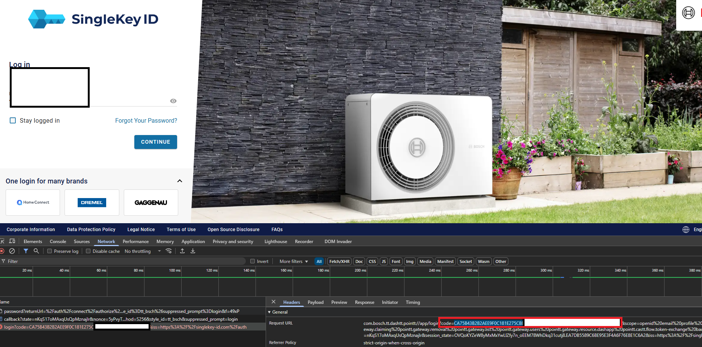

# Bosch HomeCom Easy for Home Assistant

[](https://github.com/serbanb11/bosch-homecom-hass/releases/latest)
[](https://github.com/hacs/integration)

A Home Assistant custom integration for Bosch HomeCom Easy-connected appliances. Cloud-polling, pure async, automatic token refresh.

> **Disclaimer:** This project is not affiliated with Bosch or Home Assistant.

## Supported Devices

| Device Type | Examples |
|-------------|----------|
| **RAC** | Climate Class 3000i\*, 5000i, 6000i |
| **K30 / K40** | Bosch boilers, Buderus Logatherm WLW 186i (MX300) |
| **ICOM** | IVT Aero Series, Bosch Compress 7000i/7001i AW heat pumps |
| **RRC2** | Bosch thermostats (CT200) |
| **WDDW2** | Hydronext 5700s water heaters |
| **Commodule** | Wallbox 7000i EV chargers |

:exclamation: **Any Midea-based AC or air purifier are **not** supported by this integration. If you see no devices after setup then those devices are not supported and you should use matter instead.**

## Installation

### HACS (Recommended)

1. In HACS, go to **Integrations** > **Custom repositories**
2. Add `https://github.com/serbanb11/bosch-homecom-hass` as an **Integration**
3. Search for **Bosch HomeCom** and download
4. Restart Home Assistant

### Manual

Copy `custom_components/bosch_homecom/` into your Home Assistant `config/custom_components/` directory and restart.

## Setup

The integration requires an authorization code from the Bosch SingleKey ID login flow.

1. Go to **Settings** > **Devices & Services** > **Add Integration** > **Bosch HomeCom**
2. Enter your SingleKey ID **username**
3. Open the [authorization URL](https://singlekey-id.com/auth/connect/authorize?state=nKqS17oMAxqUsQpMznajIr&nonce=5yPvyTqMS3iPb4c8RfGJg1&code_challenge=Fc6eY3uMBJkFqa4VqcULuLuKC5Do70XMw7oa_Pxafw0&redirect_uri=com.bosch.tt.dashtt.pointt://app/login&client_id=762162C0-FA2D-4540-AE66-6489F189FADC&response_type=code&prompt=login&scope=openid+email+profile+offline_access+pointt.gateway.claiming+pointt.gateway.removal+pointt.gateway.list+pointt.gateway.users+pointt.gateway.resource.dashapp+pointt.castt.flow.token-exchange+bacon+hcc.tariff.read&code_challenge_method=S256&style_id=tt_bsch) in a private browser window
4. Open the **Network** tab in Developer Tools (`F12`), then log in with your credentials
5. After the redirect fails (expected), find the request containing `code=` in the Network tab and copy the code value (ends in `-1`)

   

6. Paste the code into Home Assistant and select your devices

> **Tip:** Use a private/incognito window and complete setup quickly -- the code is single-use and expires fast.

> **Tip:** If you're having trouble capturing the authorization code, try using Microsoft Edge -- some users have reported more consistent results with its Developer Tools.

## What You Get

| Platform | RAC | K30/K40/RRC2 | ICOM | WDDW2 | Commodule |
|----------|-----|--------------|------|-------|-----------|
| Climate | HVAC modes, fan, swing, presets | Heating circuits with away mode | Heating circuits with temporary setpoint | -- | -- |
| Water Heater | -- | Operation mode | Operation mode | Operation mode + target temp | -- |
| Select | Airflow, programs | DHW/HC modes, away, holiday, ventilation summer bypass | DHW/HC modes, away | -- | Charging strategy |
| Sensor | Notifications | Notifications, DHW, HC, heat source, outdoor temp | Notifications, DHW temp + setpoint, HC, heat source, supply temp, modulation, system pressure, heat demand, working time, outdoor temp | Notifications, temperatures, flow | State, power, energy, temperature, phases, charge log |
| Switch | Plasmacluster | -- | -- | -- | Lock, auth, RFID secure |
| Fan | -- | Ventilation zones | Ventilation zones | -- | -- |
| Binary Sensor | -- | -- | -- | -- | Network connectivity |
| Number | -- | Ventilation summer-bypass duration | -- | -- | Electricity price |

### ICOM heat pump — DHW heating detection

The integration exposes `dhw1_current_setpoint` (the active DHW programme setpoint) and `dhw1_sensor` (actual tank temperature). These can be combined in `configuration.yaml` template sensors to detect heating activity that the cloud API does not expose directly:

```yaml
template:
  - binary_sensor:
      # ON when the DHW tank is being heated (actual temp more than 1 °C below setpoint)
      - name: "DHW Heating Active"
        unique_id: pac_ecs_en_chauffe
        device_class: running
        delay_on:
          seconds: 60
        state: >
          
          
          {{ actual > 0 and setpoint > actual + 1 }}

      # ON when the indoor module draws > 1200 W — indicates the backup electric
      # resistance heater is active (e.g. thermal disinfection / anti-legionella)
      - name: "Heat Pump Electric Resistance"
        unique_id: pac_resistance_electrique
        device_class: running
        delay_on:
          seconds: 30
        state: >
          {{ states('sensor.YOUR_INDOOR_MODULE_POWER') | float(0) > 1200 }}
```

The thermal disinfection (anti-legionella) programme runs at a scheduled day/time (`dhwCircuits/dhw1/tdweekDay` and `tddayTime`) using the built-in electric resistance, not the heat pump compressor — the backup heater binary sensor above reliably detects this event.

> **Tip:** Pair both binary sensors with [History Stats](https://www.home-assistant.io/integrations/history_stats/) to track cumulative DHW heating and resistance-heater run time per day and per month.

### Ventilation summer bypass

The summer-bypass `enable` toggle is a **manual override** that forces the bypass flap open for `duration` hours. Reading `enable = no` does **not** mean the flap is physically closed — the controller can still open it automatically when supply temperature falls below `minSupplyTemperature` or rises above `passiveCoolingSetpoint`. Both thresholds, plus the live `flapPower`, are exposed as attributes on the ventilation sensor for diagnosis.

## Documentation

See the **[Wiki](https://github.com/serbanb11/bosch-homecom-hass/wiki)** for full documentation:

- [Authentication details](https://github.com/serbanb11/bosch-homecom-hass/wiki/Authentication) -- step-by-step with screenshots
- [Entities reference](https://github.com/serbanb11/bosch-homecom-hass/wiki/Entities-Reference) -- complete entity list per device type
- [Custom services](https://github.com/serbanb11/bosch-homecom-hass/wiki/Custom-Services) -- DHW temperature, extra hot water, custom API queries
- [Template sensors](https://github.com/serbanb11/bosch-homecom-hass/wiki/Template-Sensors) -- energy tracking templates
- [Lovelace cards](https://github.com/serbanb11/bosch-homecom-hass/wiki/Lovelace-Cards) -- dashboard examples
- [Troubleshooting](https://github.com/serbanb11/bosch-homecom-hass/wiki/Troubleshooting) -- common issues and debug logging

## Acknowledgements

Special thanks to [RonNabuurs](https://github.com/RonNabuurs) for his valuable work on integrating **K30** support.
